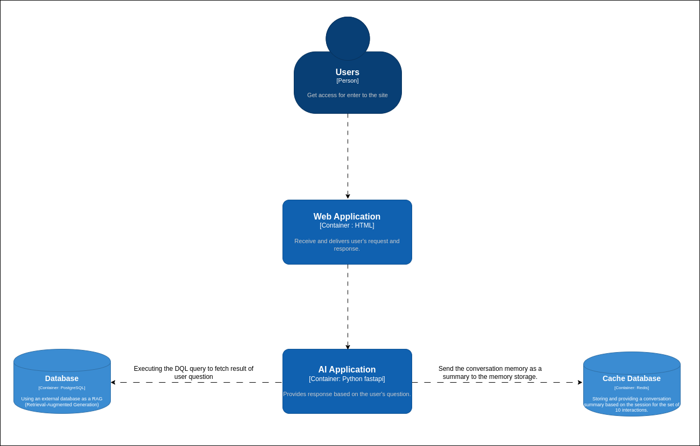
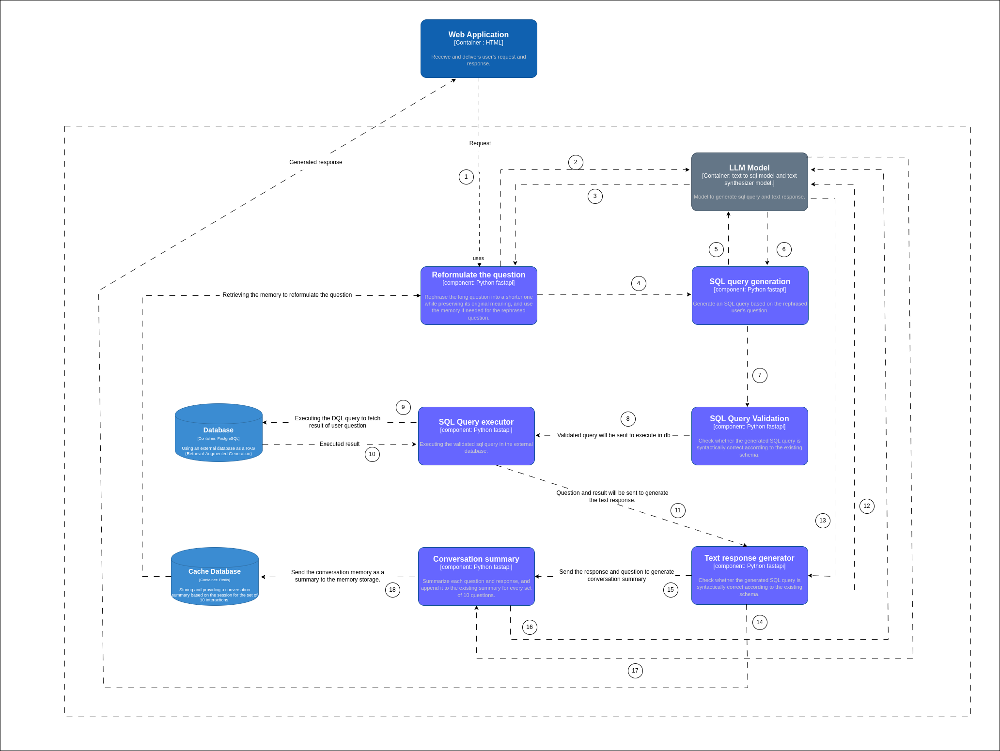

## Team Members

- [Manikandan]()
- [vallikannu]()
- [Bhuvaneswari]()
- [Induja]()
- [Vignesh]()

## Table of contents

- [Team Members](#team-members)
- [Contents](#contents)
- [Introduction](#introduction)
- [Problem Statement](#problem-statement)
- [Requirements](#requirements)
- [Architecture Approach](#architecture-approach)
  - [Security]()
  - [Modularity]()
  - [Testability]()
- [Key Architecture Challenges](#key-architecture-challenges)
- [Architecture Characteristics](#architecture-characteristics)
- [Assumptions](#assumptions)
- [Implicit Characteristics](#implicit-characteristics)
- [Feasibility (Cost/Time)](#feasibility-costtime)
- [Observability](#observability)
- [Architecture Style](#architecture-style)
- [Event Storming](#event-storming)
- [Context](#context)
- [Context Diagram](#context-diagram)
- [Glossary](#glossary)
- [Key Architecture Challenges](#key-architecture-challenges)
- [Bird's Eye System View](#birds-eye-system-view)
- [Fitness Functions](#fitness-functions)
- [Known Limitations](#known-limitations)
## Introduction

ShopWise Solutions is an innovative and fast-growing e-commerce company based in Austin, Texas, USA. Our online platform hosts a wide range of consumer products, spanning electronics, apparel, home goods, and much more. ShopWise Solutions has built a reputation for exceptional customer experience, streamlined order fulfillment, and a diverse catalog of quality products.

## Problem Statement

ShopWise Solutions is now expanding into the realm of AI-driven customer service and is in need of a new AI-powered product support assistant for our online store. This assistant will serve as the first line of support for customer inquiries regarding products, orders, returns, and refunds, all by interfacing with our existing e-commerce database.

The assistant should be able to handle customer inquiries related to products and orders. It should be capable of natural language understanding, database integration, personalized responses, multi-turn dialogues, and avoidance of hallucinations. Additionally, it should be able to manage orders and track their status.

## Requirements

- Natural Language Understanding
- Database Integration
- Personalized Responses
- Multi-Turn Dialogues
- Avoidance of hallucinations
- Order Management

## Architecture

The image is a flowchart illustrating a system architecture for processing user queries using a combination of frontend, backend, and database components.

- ## Frontend:
  - Users interact with the system through a frontend interface.
  - A load balancer manages incoming requests from users.
- ## Backend:
  - The backend handles several tasks:
    - User Query Optimization: Enhances the efficiency of user queries.
    - SQL Query Generation: Converts user queries into - SQL commands.
    - SQL Query Validator: Checks the validity of SQL queries.
    - SQL Query Executor: Executes the SQL queries.
    - Response Synthesizer: Compiles responses to user queries.
    - Conversation Summary: Summarizes interactions.
- ## Database Layer:
    - Involves data cleaning processes.
  Interacts with CSV files and databases for data retrieval and storage.
- ## Schema Storage:
  - Stores database schemas for retrieval during query processing.
- ## Redis (Cache):
  - Used for session memory management to enhance performance.
- ## LLM Server:
  - Contains models for:
    - Text to SQL Model: Translates text queries into SQL.
    - Summarization Model: Summarizes data or interactions.
- ## Observability, Monitoring, Logging:
  - Tools for tracking system performance and logging activities.

## Architecture Approach

## 1. Security

Why It Matters:

The system handles sensitive structured data, and any breach could lead to severe consequences, including data leaks or manipulation. Security ensures the integrity and confidentiality of operations.

Key Security Features:

- SQL Validation Layer (ADR-02): Validates queries to eliminate SQL injection risks and ensures table/column alignment with user queries.
- Open-Source Models (ADR-05): Avoids third-party proprietary APIs, reducing exposure to external threats and data breaches.
- Text-to-SQL Model (ADR-03): Limits query generation to DQL (Data Query Language), preventing unauthorized data modification.
- Avoiding Proprietary Models (ADR-04): Retains full control over data without exposing it to external services.
  Trade-offs:

Validation processes may slightly delay query execution.
Requires continuous updates to validation rules and mechanisms.

## 2. Modularity

Why It Matters:

A modular design simplifies development, maintenance, and scaling. It allows individual components to evolve without disrupting the entire system.
Key Modularity Features:

Microservices Architecture: Separates the application into distinct services:
AI Engine: Responsible for query generation.

- Open-Source Framework (ADR-05, ADR-08): Supports customization and flexibility, enabling the substitution or enhancement of individual modules.
- Lightweight Execution (ADR-08): Ensures deployment flexibility across diverse hardware, maintaining independence between system components.
  Trade-offs:

Initial setup and integration can be more complex compared to monolithic systems.
Communication between modular services may introduce minimal latency.

## 3. Testability

Why It Matters:

- Testability ensures system reliability by allowing each component to be validated individually. It reduces debugging time and ensures components behave as expected under varying conditions.
  Key Testability Features:

- SQL Query Validation (ADR-02): Acts as a checkpoint to test the correctness of SQL queries before execution.
- Open-Source Models: Provide transparency, enabling extensive testing and fine-tuning to meet application-specific needs.
- Modular Design: Allows individual services (e.g., AI Engine, Validation Layer) to be tested in isolation, ensuring end-to-end reliability.
- Reset Mechanism (ADR-01): Periodically resetting conversation memory reduces the accumulation of errors, making it easier to diagnose issues within a defined interaction window.
  Trade-offs:

Validation and isolation testing may require additional resources and time during development.
Comprehensive test coverage for evolving use cases and schemas requires ongoing effort.

## Assumptions

The system assumes a robust infrastructure to support AI-driven processes, including natural language understanding and query validation. User data will be available for personalization while adhering to privacy regulations. The chat application will integrate seamlessly with existing databases and APIs, ensuring minimal disruption to current workflows.

## Implicit Characteristics

The system prioritizes user engagement, accuracy, and scalability. It assumes minimal latency despite the use of computationally intensive techniques like Chain of Thought prompting and real-time query validation.

## Feasibility (Cost/Time)

While adopting cutting-edge solutions like personalized recommendations and voice-to-text functionality adds value, the initial costs and time for implementation are significant. For example, building a custom workflow instead of using LangChain required more effort but ensured better alignment with business goals. 

## Observability

Comprehensive monitoring and logging mechanisms will be implemented to observe system performance and user interactions. Feedback loops enable real-time improvement by identifying problematic areas or recurring user complaints.

## Architecture Style

The system adopts a modular, service-oriented style, enabling high cohesion within components and low coupling between them. The Chain of Thought (CoT) approach for problem-solving embodies a human-like reasoning framework, enhancing user trust and transparency.

## Event Storming

Event storming sessions were conducted to identify key workflows and interactions within the system. Critical user actions like querying, feedback provision, and personalized recommendations were mapped to corresponding system events, uncovering bottlenecks and improvement opportunities.

## Context

The chat application serves as a personalized, AI-driven interface for users interacting with database systems. It addresses challenges like bias elimination, query validation, and personalized recommendations. The system’s user-centric design ensures inclusivity and accessibility.

## Context Diagram

This high-level diagram depicts the chat application interfacing with:

Users represent individuals who interact with the system by sending requests, such as queries or commands, and receiving responses. Their interactions are facilitated through the User Interaction with Chat System, which serves as the primary interface. This component processes user requests, retrieves relevant information from a dataset, and generates responses in a natural, human-like manner. After generating a response, the system sends a summary of the interaction to the Chat System with Memory Store, which functions as a backend for managing conversational memory. This memory store saves the summarized conversation data and retrieves it during subsequent interactions based on the user's session.

- Database Systems: For query execution and schema validation.
- External APIs: For data retrieval.
- User Interface: For providing personalized responses and gathering feedback.
  Containers

Web Application, built using html, serves as the intermediary between the users and the backend components. It receives the user's input and forwards it to the AI Application, which is implemented using Python FastAPI. The AI Application processes the user’s query and generates a relevant response based on the question.

To ensure the system's performance and relevance, the AI Application executes a query on the Database (PostgreSQL), using a Retrieval-Augmented Generation (RAG) approach. This enables the system to fetch necessary data to enrich the response. The response generated by the AI Application is then sent back to the user via the Web Application.

Additionally, to maintain conversation continuity, a Cache Database (using Redis) is employed. It stores a summary of the interactions from the current session, providing fast access to previous conversation data for up to the last 10 interactions. This helps in delivering personalized and context-aware responses by leveraging past conversations. Furthermore, as interactions progress, the system updates the cache with new summaries, ensuring an efficient and responsive user experience.

## ADRs

Decisions like transitioning away from GGUF, adopting CoT prompting, and implementing personalized recommendations are documented in detail to ensure transparency and guide future development.

## Glossary

- CoT (Chain of Thought): A technique for step-by-step problem-solving.
- GGUF: General Gradient Universal Format, a model format initially used.
- PostgreSQL: Open-source relational database used for data storage.

## Key Architecture Challenges

- Bias Reduction: Ensuring fair query handling and personalized recommendations.
- System Performance: Managing latency due to validation and reasoning processes.
- User Engagement: Balancing detailed responses with response time.
- Architecture Characteristics
  The system is scalable, secure, reliable, and user-centric, emphasizing transparency and efficiency in responses and operations.

## Bird's Eye System View

The flowchart depicts a web application's process for handling user queries using an LLM and SQL database. When a user submits a query, the application sends it to a containerized LLM, which reformulates the question for clarity and generates a corresponding SQL query. This query is then validated to ensure it aligns with the database schema. Once validated, the SQL query is executed to fetch the required data from the database. The retrieved data is used to generate a text response for the user. Additionally, the system includes a cache for storing conversation history to enhance future interactions and a component that summarizes past interactions to update memory storage, ensuring efficient and accurate query handling.

## Fitness Functions

- Response Accuracy: Validate SQL and user queries for correctness.
- User Engagement: Measure feedback scores and retention rates.
- Latency: Optimize reasoning and validation times for efficient responses.
- Team Topologies
- A cross-functional team structure ensures collaboration across AI development, database management, and frontend/backend integration.

## Known Limitations

- Latency: Slight delays due to CoT and query validation.
- Migration Complexity: Legacy systems require significant updates to adapt to the new architecture.
